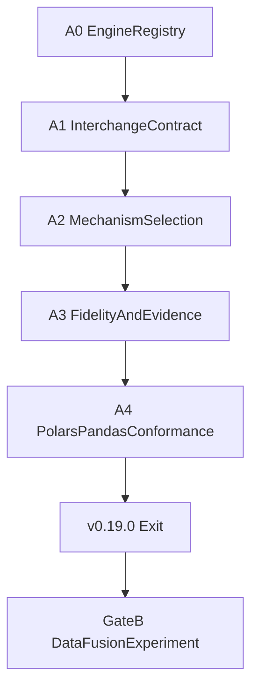

# 0.18 Versioned Tabular Interchange Plan (Gate A)

> **Status: Gate A shipped in 0.19.0.** Versioned tabular interchange is
> available for the Polars↔Pandas conformance pair. Gate B (DataFusion) remains
> planned for 0.19+ and did not ship in 0.19.0. The older Arrow helper remains
> a legacy **best-effort conversion** path.

This plan records the shipped 0.18 Gate A scope, contracts, milestones, and
the still-planned Gate B policy.

## Decision locks

| Decision | Lock |
|---|---|
| **0.19.0 ships Gate A only** | Versioned tabular interchange. DataFusion does **not** block 0.19.0 |
| **DataFusion** | Non-blocking **Gate B / 0.19+** experiment with graduation criteria written before scaffolding |
| **0.18 conformance pair** | Polars + Pandas only. PySpark/SQL Arrow boundaries are explicit follow-ups |
| **Engine registry** | Capability/registry generalization is a **Gate A prerequisite (A0)**, not deferred into DataFusion |
| **Parquet** | Durable **artifact** strategy, not conflated with in-process Arrow C / IPC transport |
| **Semantic authority** | Pydantic / ContractModel and ODCS / DTCS / DPCS remain the contract layer; Arrow is physical interchange only |
| **Core deps** | Installing `etlantic` alone must not install or import PyArrow or DataFusion |
| **0.17 continuation** | Gate A may proceed in parallel with unfinished portable continuation families; **0.19.0 exit does not depend on them** |

## Non-goals for 0.19.0

- DataFusion package scaffolding, recommendation, or graduation
- PySpark or SQL Arrow physical boundaries
- Multi-tenant streaming fabric or distributed Arrow flight services
- Replacing ETLantic logical contracts with Arrow schemas
- Making PyArrow a core dependency
- Silent exception swallowing on conversion failure (today’s best-effort helper must be replaced, not papered over)

## Relationship to the legacy 0.17 path

In 0.17, optional PyArrow enables **best-effort Arrow-assisted dataframe
conversion**. That path:

- is not a versioned plan decision;
- does not record mechanism, ownership, or observed copy evidence as a first-class interchange contract;
- must not be advertised as the formal 0.18 interchange surface.

See [Capabilities](../01_GETTING_STARTED/CAPABILITIES.md).

---

## Gate A — Versioned tabular interchange (0.19.0)

### Architectural boundary

```text
ETLantic logical contracts (ODCS/DTCS/DPCS)
        │
        ▼
PipelinePlan (deterministic, secret-free)
        │
        ├── etlantic.interchange/1  ← physical boundary decision
        │         ├── arrow_c_stream / arrow_c_data
        │         ├── arrow_ipc_stream / arrow_ipc_file
        │         ├── parquet_artifact
        │         └── records_or_native_fallback
        ▼
Plugin runtimes (Polars, Pandas, …)
```

### `etlantic.interchange/1` descriptor

Every planned cross-plugin tabular boundary records an immutable descriptor
(secret-free; no live Arrow objects; no source rows):

| Field | Meaning |
|---|---|
| `schema` | Literal `etlantic.interchange/1` |
| `mechanism` | One of the mechanism vocabulary values below |
| `producer_engine` / `consumer_engine` | Registered engine ids (from capabilities, not hard-coded pairs) |
| `producer_caps` / `consumer_caps` | Relevant capability claims used for selection |
| `schema_fingerprint` | Stable fingerprint of the **logical** contract + normalized physical mapping inputs |
| `ownership` | Who owns buffers/streams/files until release (producer, consumer, runtime) |
| `batching` | Declared batch policy (size hint / stream vs collect) |
| `collection` | Whether eager collection is required at this boundary |
| `copy_eligibility` | Planned zero-copy eligibility (`eligible`, `copy_required`, `unknown`) |
| `fallback_reason` | Null when Arrow path selected; otherwise why records/native was chosen |
| `evidence_refs` | Keys into run-report evidence for observed conversion/copy/cleanup |

**Compatibility:** Plans produced under 0.17 that lack `etlantic.interchange/1`
remain valid only via **regenerate** (`etlantic plan` / `Pipeline.plan`). There
is no silent upgrade of stored plans. Hand-edited plans that invent descriptors
fail closed.

**Fingerprint rule:** Fingerprints cover logical identity and the normalized
mapping inputs used for the decision—not live arrays, not secret values, not
host-local file paths that embed credentials.

### Mechanism vocabulary

| Mechanism | Kind | Notes |
|---|---|---|
| `arrow_c_data` | In-process | Single-shot C Data interface |
| `arrow_c_stream` | In-process | Streaming C Stream interface |
| `arrow_ipc_stream` | Transport | Arrow IPC stream bytes/channel |
| `arrow_ipc_file` | Transport | Arrow IPC file container |
| `parquet_artifact` | Durable artifact | Parquet under ETLantic artifact/storage policy—not an in-process transport |
| `records_fallback` | Fallback | Row/record materialization when Arrow is unavailable or contract-unsafe |
| `native_fallback` | Fallback | Engine-native conversion path when explicitly capability-advertised |

### Selection truth table

Inputs: producer capabilities, consumer capabilities, whether the boundary
already requires materialization, whether durability across process restart is
required.

| Producer | Consumer | Durable? | Already collecting? | Selected mechanism | Otherwise |
|---|---|---|---|---|---|
| `arrow_c_stream` | `arrow_c_stream` | No | No | `arrow_c_stream` | — |
| `arrow_c_data` | `arrow_c_data` | No | Yes | `arrow_c_data` | — |
| `arrow_ipc_*` | `arrow_ipc_*` | No | Either | Matching IPC mechanism | Prefer stream when both advertise stream |
| Both advertise Parquet artifact + storage | Both | **Yes** | Either | `parquet_artifact` | — |
| Any Arrow claim missing / mismatch | — | — | — | — | `records_fallback` or fail closed |
| Mapping would lose required logical semantics | — | — | — | — | **Fail before mutation** (no silent fallback) |
| PyArrow absent in process | — | — | — | `records_fallback` or `native_fallback` | Record `fallback_reason` |

Unsupported, unavailable, or lossy conversions produce an explicit plan or
runtime diagnostic and **fail before mutation** when the logical contract
cannot be preserved. “Zero copy” may appear in reports only when
`copy_eligibility=eligible` **and** observed evidence confirms zero copy.

### Fidelity matrix

ETLantic logical contracts remain authoritative. Arrow physical types are a
mapping layer.

| Type family | Policy when lossless mapping exists | Policy when mapping is ambiguous or lossy |
|---|---|---|
| Nullability | Accept with evidence | **Fail** if required non-null would become nullable without acknowledgement |
| Decimal | Accept exact precision/scale | **Fail** on precision/scale downgrade |
| Temporal / timezone | Accept normalized UTC or named zone per contract | **Fail** on silent local-timezone reinterpretation |
| Nested (struct/list) | Accept structural match | **Fail** on field drop/reorder that changes contract identity |
| Dictionary-encoded | Accept if values round-trip | Warn + copy (not zero-copy) if decode required; **Fail** if values cannot round-trip |
| Extension types | Accept only when both sides advertise the extension | **Fail** or records fallback when unadvertised |
| Field order | Accept if names+types match under contract rules | **Fail** when order is semantically significant and would change |

Silent exception swallowing (today’s best-effort helper pattern) is forbidden
for Gate A boundaries.

### Quantitative bounds (initial Gate A defaults)

These are the documentation defaults for conformance; implementations may
tighten but must not silently exceed without a plan/report field.

| Bound | Default |
|---|---|
| Max batch rows (stream) | 65_536 |
| Max in-flight batches per boundary | 2 |
| Max buffered bytes per boundary (soft) | 64 MiB |
| Time-to-first-batch budget (local) | Recorded in evidence; no silent unbounded block |
| Retry on stream failure | Fail closed after one cleanup; no infinite retry |
| Stream/file lifetime | Tied to run/branch; cleanup on success, cancel, and failure |
| Branch isolation | No sharing of mutable Arrow buffers across concurrent branches |

Core unit/import tests **must pass without PyArrow installed**.

### Trust and packaging

- PyArrow remains optional via `etlantic[arrow]` / plugin extras.
- Core never imports PyArrow.
- Production `plugin_allowlist` continues to pin distribution names and
  versions. A single distribution that exposes both dataframe and
  transform-compiler entry points must be allowlisted once per distribution
  identity; capability kinds remain distinct in inventories.
- Plans and reports contain mechanism decisions and fingerprints only—never
  live Arrow handles, Arrow IPC payloads, or source rows.

### Conformance scope (0.19.0)

**In scope:** Polars ↔ Pandas cross-plugin boundaries using Gate A.

**Out of scope for 0.19.0 (tracked follow-ups):** PySpark Arrow boundaries,
SQL driver/Arrow paths, DataFusion.

---

## Gate A milestones (A0–A4)

| Milestone | Deliverable | Exit criteria |
|---|---|---|
| **A0** Engine registry | Capability/registry-driven dataframe dispatch; remove hard-coded engine-name assumptions for **new** interchange boundaries | Ownership/collection decisions come from capabilities; no new Gate A code path keys solely on fixed `DATAFRAME_ENGINES` pairs |
| **A1** Contract | `etlantic.interchange/1` in plan explain + run report | 0.17 plans without the descriptor still validate via regenerate; invented descriptors fail closed |
| **A2** Selection | Truth table implemented in planner/runtime | Unsupported/lossy cases emit diagnostics **before mutation**; fallback reasons recorded |
| **A3** Fidelity / evidence | Fidelity corpus + bounds | Zero-copy only when planned eligibility and observed evidence agree; no silent swallow |
| **A4** Conformance | Polars↔Pandas Arrow suite | Non-Arrow fallback remains; core tests pass without PyArrow |
| **0.19.0** | A0–A4 complete | CAPABILITIES, COMPATIBILITY, What’s New, and Migration describe the formal boundary (not best-effort conversion) |



---

## Gate B — Experimental DataFusion (non-blocking; 0.19+)

Gate B **begins only after Gate A / 0.19.0**. It does not block 0.19.0 and does
not replace Polars as the reference dataframe backend or `LocalScheduler` as
the coordinator.

### Packaging

```bash
pip install "etlantic[datafusion]"
# equivalent distribution: etlantic-datafusion
```

- Independently versioned first-party plugin
- Separate dataframe-runtime and `etlantic.transform_compilers` entry points
- DataFusion/Arrow deps live in the plugin stack, never in core

### Initial claim set (kernel only)

Truthful DTCS kernel claims only after public conformance passes:

- projection, filtering, with-fields, rename/drop
- scalar expressions and supported casts

Joins, unions, grouping, aggregation, sorting, and relational `/1` expand
**only after** kernel conformance and differentials pass.

### Required comparison corpus

Reproducible fixtures vs local records and Polars measuring:

- cold import and install footprint
- plan/compile and execution latency
- peak memory and materialization/copy counts
- batch streaming and time-to-first-batch
- schema/value fidelity
- diagnostic quality and logical-step attribution

### Graduation thresholds

`etlantic-datafusion` becomes **recommended** only when all hold:

1. Dataframe + portable conformance suites pass for advertised claims
2. Cross-engine differentials vs Polars (intersection) pass
3. Gate A Arrow boundary tests pass
4. Failure, cancellation, cleanup, trust, and redaction tests pass
5. **At least one measured advantage** in local analytical performance,
   laziness/conversion cost, or external interoperability vs the Polars
   reference on the published corpus

A working adapter that only duplicates Polars is insufficient.

### Support policy (installed but ungraduated)

- Marked **Experimental** in Capabilities and package classifiers
- Best-effort fixes only; no SLA
- May change or be removed in a minor without 1.0 compatibility obligation
- Must not become the default engine merely because installation works

### Stop rule

Stop or keep experimental when any stop condition below triggers. Failed
experiments create **no** 1.0 compatibility obligation.

---

## Stop conditions (all gates)

Stop or defer a component when:

- it requires backend classes or live objects in core protocols or serialized plans;
- it adds a mandatory heavy dependency to the core wheel;
- semantic loss cannot be detected before mutation;
- source rows or resolved secrets would enter plans, diagnostics, reports, or schema history;
- it duplicates an existing engine without measurable benefit;
- it makes CLI, embedded SDK, or scheduler use depend on another surface.

## Release evidence (every shipped gate)

- exact capability and compatibility matrices
- deterministic golden artifacts
- public conformance and cross-engine differential results
- clean-environment dependency/import checks (with and without PyArrow)
- failure, cancellation, cleanup, trust, and redaction tests
- reproducible performance measurements where value is performance-based
- limitations, fallback behavior, and migration/rollback notes

Normative milestone narrative also lives in the
[roadmap](https://github.com/eddiethedean/etlantic/blob/main/ROADMAP.md)
section **0.18 — Versioned Tabular Interchange (Gate A)**.
